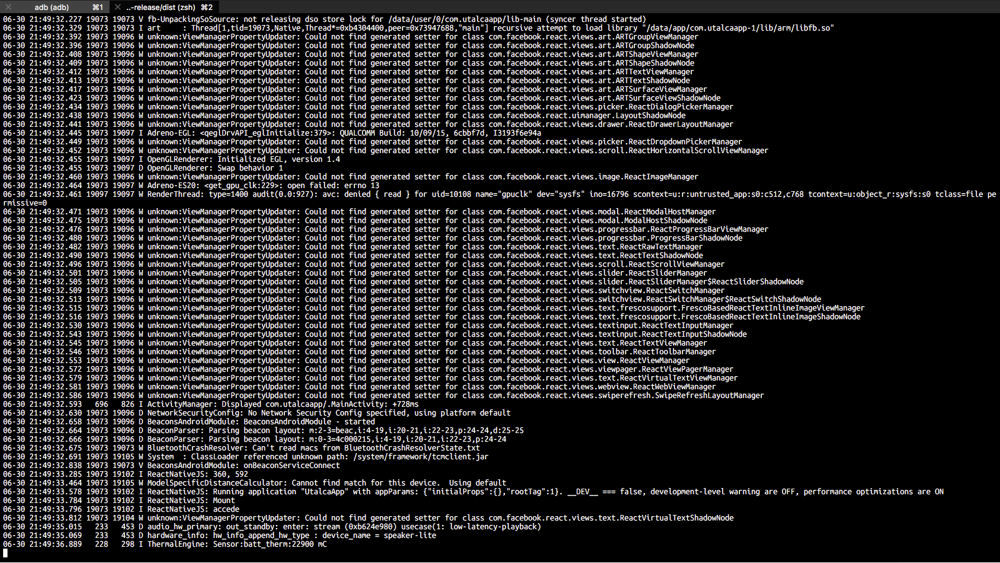
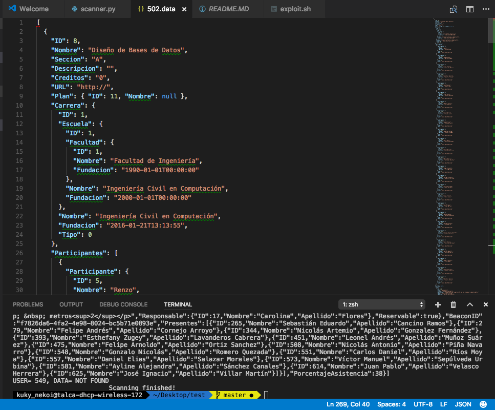

# Crazy Unicorn
An exploit for UtalcaAPP which allows users to attend any class as long as they extract data from near USB beacons and then reuse the beacon/server data to attend from home.

## Motivation
* Contribute to QA process while the app is on testing process.
* Satisfy my curiosity.
* I wanted to make sure that the final product can compete with my standards.

## How does it works
Its decompiles the original APK and then injects a payload into it. The payload is used to track any communication between the cellphone to the servers and the beacons. The info tracked is used to grab auth credentials which allows to automate the process of getting an attendance mark on the platform.

## Pre-Requisites
* [GNU BASH](https://www.gnu.org/software/bash/)
* [Android Development Tools](https://developer.android.com/studio/index.html)
* [cURL](https://curl.haxx.se)
* [apktool](https://ibotpeaches.github.io/Apktool/)
* [keytool and jarsigner](https://stackoverflow.com/questions/4830253/where-is-the-keytool-application) (provided by Java SDK)
* [zipalign](https://stackoverflow.com/questions/31048208/zipalign-command-not-found) (provided by Android Development tools)
* [python2.7](https://www.python.org/download/releases/2.7/) (provided by Android Development tools)

## How to use it
```bash
chmod +x ./exploit.sh
./exploit.sh
```

## Security report (for academical purposes)
### Audit stage
I started by checking android log. This gave me some pointers about where to start digging.

As it can be seen due to the debug log still present on the application, the application was built using [ReactNative](https://facebook.github.io/react-native/) which is a JavaScript framework to build mobile applications.

### Dissasembly and study stage
After decompiling the apk I found some interesting things. 
* The beacon module is built as a native Java module, imported onto React.
* Most of the [smali](https://github.com/JesusFreke/smali) code looks like copypasted from another source or maybe two developers worked on this app.
* The features of the beacon module is to scan and bring up listeners to detect when a beacon is nearby.
* The beacon module is used on listeners of the ReactNative app, all variables are exposed to ReactNative as soon as a beacon shows up.
* Beacon detection is not triggered until the user gets the course list. Then, beacon detection turns on and continously scans for nearby beacons, changing flags for every course detected and enabling the "attend" button.
* There are some complex energy-saving configurations emmbebed in the code. The logic style suggest that it was probably copypasted.
* Every query is made over **HTTP** [which is known by not being a safe protocol](https://www.entrepreneur.com/article/281633). This allows to track every comm between server and cellphone.
* Auth is made by sending credentials as plain text over HTTP, which can be easily intercepted.
* Every other method is secured by a session cookie installed onto the ReactNative webview. This cookie is not handled on any other place.
* The following enpoints are hardcoded onto the application:


    * [POST] http://test.ingenieriautalca.cl/api/CuentaApi/Ingresar

        Body:
        ```javascript
        { 
            email: String, 
            password: String 
        }
        ```
        Response: 
        ```javascript
        Number //The student id number
        ```

        This method also injects a session cookie, namely `.ASPXAUT`.

    * [POST] http://test.ingenieriautalca.cl/api/CursoApi/ProximasClases

        Body:
        ```javascript
        { 
            ID: String // The student id
        }
        ```
        Response: 
        If the course exists, then it returns the following structure:
        ```javascript
        [
            {
                "Carrera": {
                    "Escuela": {
                        "Facultad": {
                            "Fundacion": Date, 
                            "ID": Number, 
                            "Nombre": String
                        }, 
                        "Fundacion": Date, 
                        "ID": Number, 
                        "Nombre": String
                    }, 
                    "Fundacion": Date, 
                    "ID": Number, 
                    "Nombre": String, 
                    "Tipo": Number
                }, 
                "Creditos": String //but represents a number, 
                "Descripcion": String, 
                "Horario": [
                    {
                        "BeaconID": UUID, 
                        "Descripcion": String, 
                        "Fecha": Date, 
                        "FechaFin": Date, 
                        "ID": Number, 
                        "Presentes": [], 
                        "Sala": {
                            "Capacidad": Number, 
                            "Descripcion": String, 
                            "ID": Number, 
                            "Nombre": String, 
                            "Reservable": Boolean, 
                            "Responsable": {
                                "Apellido": String, 
                                "ID": Number, 
                                "Nombre": String
                            }, 
                            "Tipo": Number, 
                            "Ubicacion": {
                                "Direccion": String, 
                                "Indicaciones": String, 
                                "Latitud": Float, 
                                "Longitud": Float
                            }
                        }, 
                        "Tipo": String, 
                        "Titulo": String
                    }
                ], 
                "ID": Number, 
                "Nombre": String, 
                "Participantes": [
                    {
                        "Fecha": Date, 
                        "Participante": {
                            "Apellido": String, 
                            "ID": Number, 
                            "Nombre": String
                        }, 
                        "Tipo": Number
                    }
                ], 
                "Plan": {
                    "ID": Number, 
                    "Nombre": null
                }, 
                "PorcentajeAsistencia": Number, 
                "Seccion": String, 
                "Syllabus": null, 
                "URL": URL
            }
        ]
        ```
        Otherwise, returns an empty array.

    * [POST] http://test.ingenieriautalca.cl/api/CursoApi/RegistrarAsistencia

        Body:
        ```javascript
        { 
            Clase: {
                ID: String // the course specific id for a given time.
            }, 
            Participante: {
                ID: String // the student id number
            }
        }
        ```
        Response: 
        `false` if the student is not enrolled on the course or if it's outside the schedule range.
        `true` otherwise.

    * All of those enpoints can be exploited in order to get the access token and the attendance mark.

### Exploitation stage
Exploitation was made by modifying ReactNative bundle which is plain available on the disassemblied apk and [using it as a payload to the native application,](./payload.js) that way we can have some degree of control over the beacon data, credentials and other stuff.

After that a shell script was built in order to automatize the process and a python script was made in order to get additional info and build other data. **TODO**

All data is dumped onto results folder.

### Results
#### Attendances
I can mark attendance by using the endpoint `http://test.ingenieriautalca.cl/api/CursoApi/RegistrarAsistencia` just adding the info requested. No beacon id is required to confirm during the process.

#### Course listing
I can get all info of all courses. No session is validated beforehand. This is proof that access control is not implemented despite having passed the effort of faking an auth process. 

#### Side effects
All info about the alumni scheduling is exposed as well as their attendance records.

## Mitigations

* Rename all endpoints to not use "so trivial" names
* Obfuscate the code before shipping it.
* Train your developers about security issues derived from using Javascript applications.
* Use HTTPS on the serverside.
* ~~Use another auth system, if possible token-base~~~ Implement an access control list for attendant and course elements.
* Remove default error messages as they leak information about the underlying infrastructure.
* Don't rely on cookies to store sessions, in this case, token-based solutions like Keycloak would suit well this kind of projects.

## Personal thoughts
As fas as I can see, there is no other way rather to reimplement the whole application using the Android SDK, preferably using C++ libs because JavaScript frameworks [are not suited for secure developments if the person responsible ignores it's risks](https://github.com/facebook/react-native/issues/1093). If there are no plans to mitigate it though a whole redesign of the application then you can secure the auth process by using [JSON Web Tokens](https://jwt.io) to cypher all data sent over network, which is a good practice for all browser-based apps and also use HTTPS instead of HTTP to secure the communications.

I can understand that the application is under testing stage, but I don't feel comfy about people who doesn't now a thing about security sharing a password here which could be hijacked by mischievous persons. 

## Acknowledgements
* To *"el gotito naranjo"* which died a month ago due to the vicious dogs in front of the campus. He was part of the souce of inspiration.

